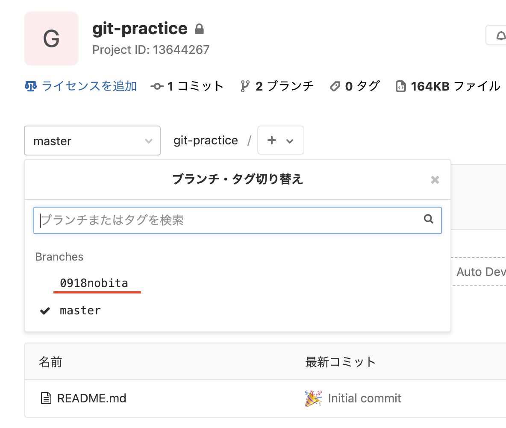
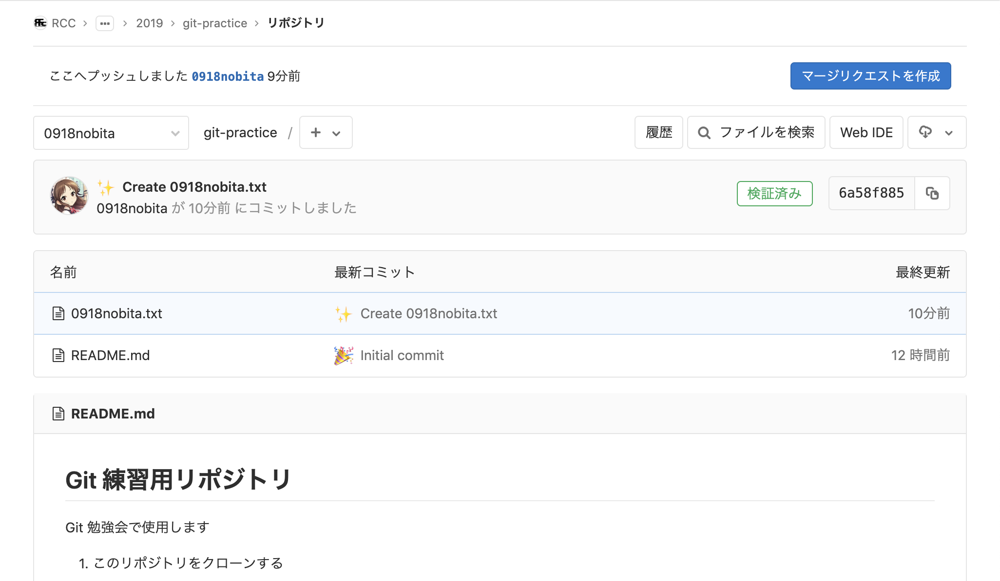
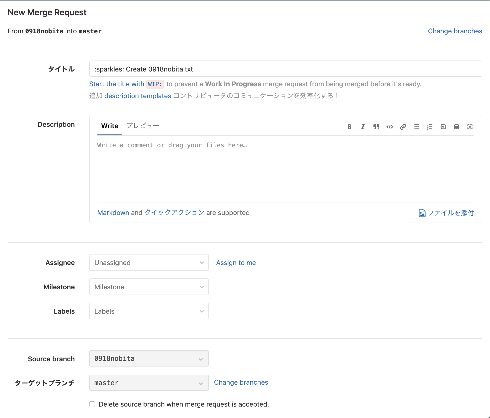
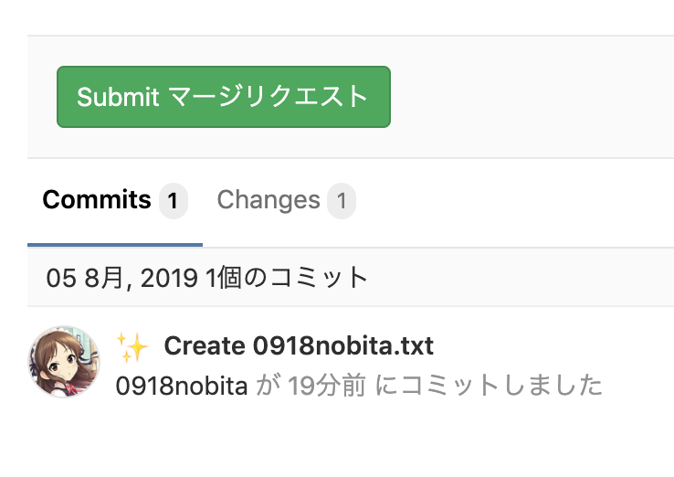
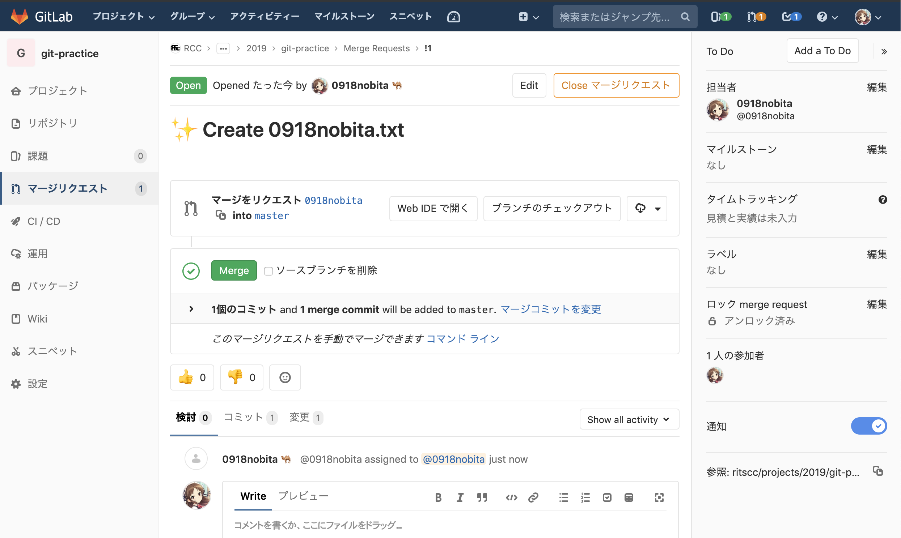
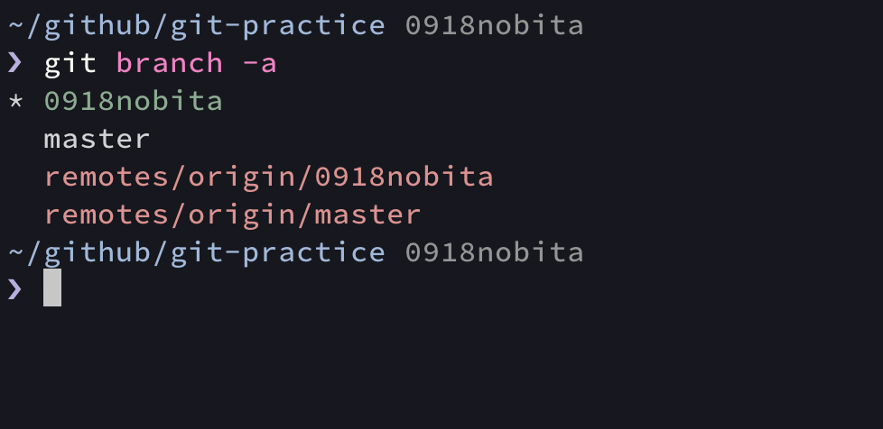
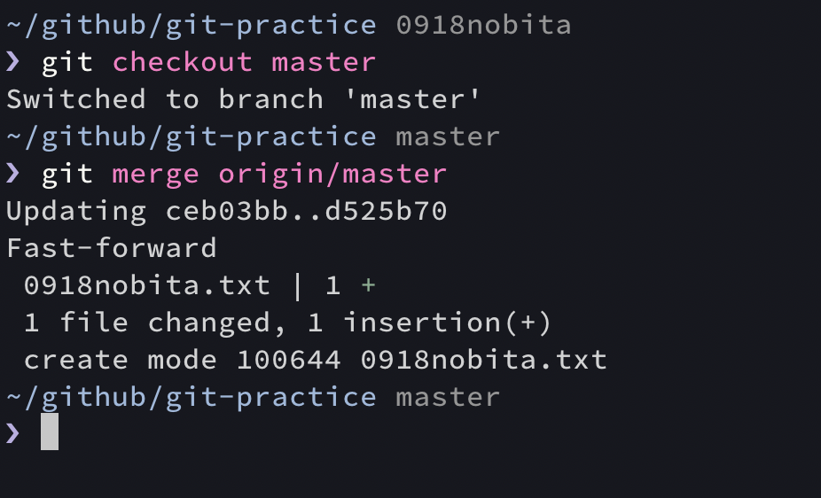
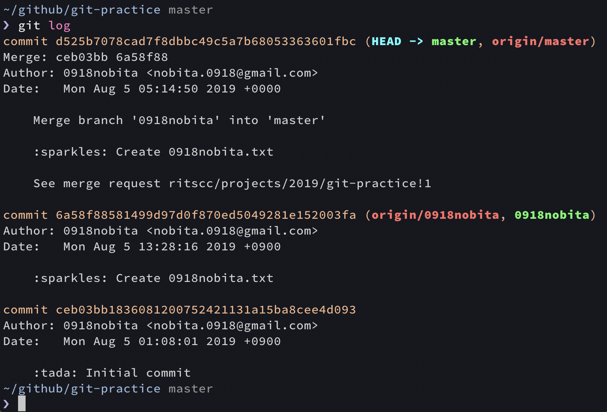

# マージリクエスト / マージ

**マージ** は、分岐した先のブランチから分岐元のブランチへと変更差分を統合する機能です。

**マージリクエスト** (= GitHub / Bitbucket での「プルリクエスト」) は、ホスティングサービス側でマージ操作を申請する機能です。
レビュー機能も含まれていて、担当者が差分を確認してマージを許可するか否かを決めることが出来ます。

**【やること19】** GitLab の git-practice リポジトリのページ ( https://gitlab.com/ritscc/projects/2019/git-practice ) を開き、`master` ブランチから自分が作成したブランチに切り替えてください。

↓ ここでは「0918nobita」ブランチを選択



---

**【やること20】** 右上の「マージリクエストを作成」ボタンをクリックしてください。



---

**【やること21】** 遷移先の画面で「Source branch」の項目が「自分が作成したブランチ」に、「ターゲットブランチ」が「master」になっていることを確認してください。



---

**【やること22】** 「Submit マージリクエスト」ボタンをクリックしてください。



---

**【やること23】** 担当者に「0918nobita」を追加してください。



---

**【やること24】** Git 勉強会担当者が手動で Approve してマージ可能になったら、自分でマージしてください。

---

**【やること25】**

複数人でこのハンズオンを進めていくと、リモートリポジトリ側がどんどん更新されていきます。

リモートリポジトリ側の最新の情報を取得するための、以下のコマンドを実行してください。

```bash
git fetch origin
```

このコマンドを用いると、指定したリモートリポジトリでの最新の変更差分を取得し、ローカルリポジトリでの「**リモート追従ブランチ**」と呼ばれる普段は見えないブランチが更新されます。

リモート追従ブランチは、リモートリポジトリ側のブランチをコピーしたものです。

↓ のように、``git branch -a`` コマンドを用いて、リモート追従ブランチを含めてすべてのブランチを確認することができます。

 

---

**【やること26】**

1. `master` ブランチにチェックアウトしてください。
2. リモートリポジトリの `master` ブランチでの差分を、ローカルリポジトリの `master` ブランチに反映するための、以下のコマンドを実行してください。

```bash
git merge origin/master
```



``git merge <ブランチ名>`` コマンドで、今選択しているブランチに、`<ブランチ名>` で指定したブランチでの変更を統合することができます。

つまり、先程 ``git merge origin/master`` を実行したことで、リモートリポジトリの `master` ブランチ ( ``git fetch`` を実行した時点のもの ) での変更差分が、ローカルの `master` ブランチに統合されたことになります。

↓ 今選択しているブランチでのコミット履歴を確認する ``git log`` コマンドを実行すると、たしかにマージできていることがわかります。


