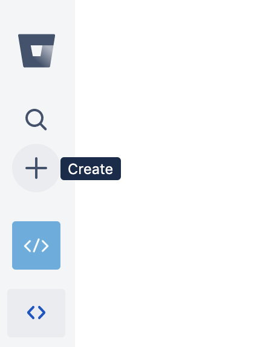
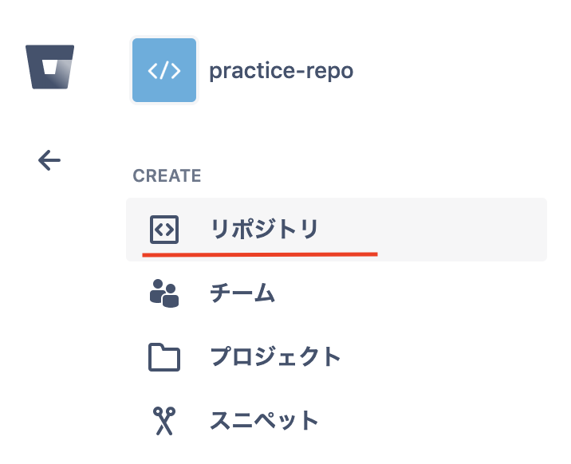
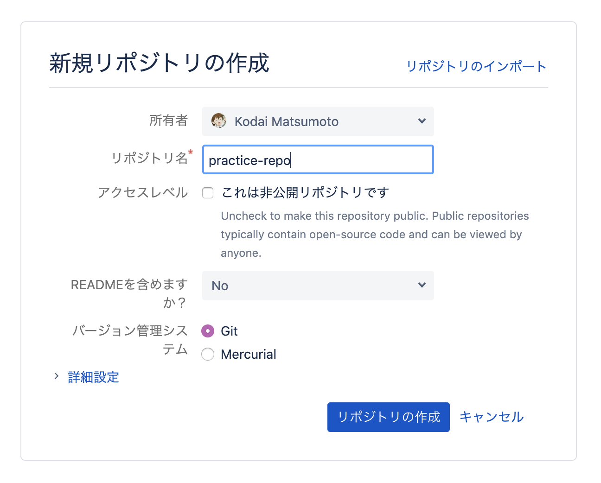

# リモートリポジトリの作成

**【やること2】** 以下の手順でリモートリポジトリを作成してください。

(1) まずサイドバーの「＋」ボタンをクリック

(2) 「リポジトリ」をクリック

(3) 適当なリポジトリ名 (ここではとりあえず「practice-repo」) を入力し、「リポジトリの作成」をクリック

**【やること3】** リモートリポジトリの SSH 用アドレスをローカルリポジトリに設定してください。

