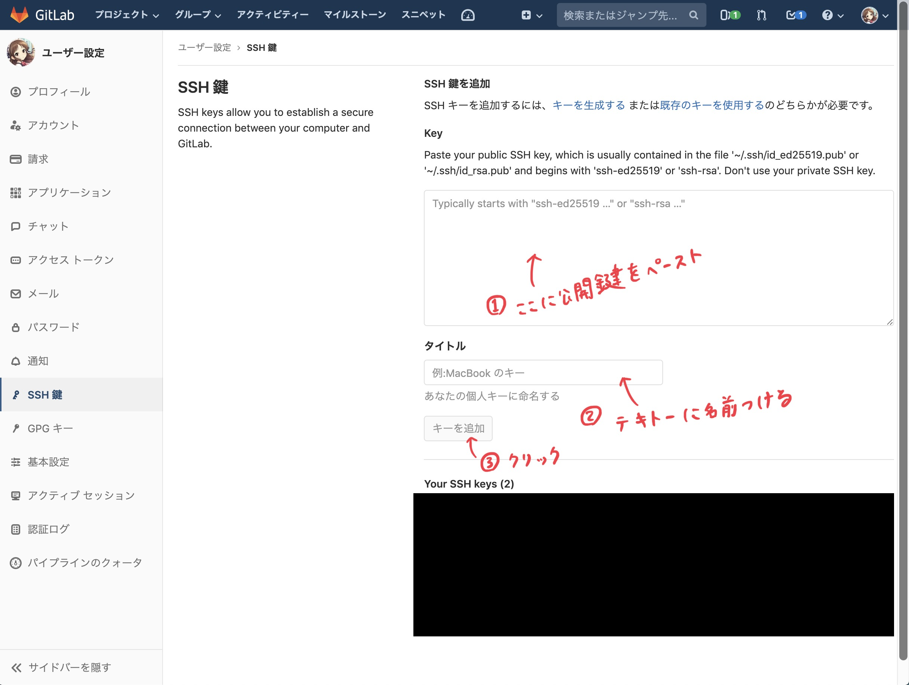

# SSH 鍵の生成・登録

今後 git を操作して GitLab 側にアクセスすることになりますが、  
その際の認可のために SSH 公開鍵 / 秘密鍵を生成し、公開鍵を GitLab 側に追加する必要があります。

**【やること7】** コマンドを実行して、SSH の公開鍵 / 秘密鍵を生成してください。

#### Windows

```bat
$ cd c:/Users/[ユーザー名]/
$ mkdir .ssh
$ c:/git/bin/ssh-keygen -t rsa
Generating public/private rsa key pair.
Enter file in which to save the key (/c/Users/[ユーザー名]/.ssh/id_rsa): <そのままEnterキーを押す>
Enter passphrase (empty for no passphrase): <パスワードを考えて入力する>
Enter same passphrase again: <もう1度パスワードを入力する>
Your identification has been saved in c:/Users/[ユーザー名]/.ssh/id_rsa.
Your public key has been saved in c:/Users/[ユーザー名]/.ssh/id_rsa.pub.
The key fingerprint is:
~~~~
```

#### macOS / Linux

```bash
$ ssh-keygen -t rsa
Generating public/private rsa key pair.
Enter file in which to save the key (/Users/[ユーザー名]/.ssh/id_rsa): <そのままEnterキーを押す>
Enter passphrase (empty for no passphrase): <パスワードを考えて入力する>
Enter same passphrase again: <もう1度パスワードを入力する>
Your identification has been saved in /Users/[ユーザー名]/.ssh/id_rsa.
Your public key has been saved in /Users/[ユーザー名]/.ssh/id_rsa.pub.
The key fingerprint is:
~~~~
```

### 公開鍵を GitLab に登録する

先程生成した ``id_rsa.pub`` の内容をクリップボードにコピーしておいて貼り付けてください。

Windows の場合、コマンドプロンプト上で ``clip < c:/Users/[ユーザー名]/.ssh/id_rsa.pub`` を実行するとコピーできます。  
macOS の場合、ターミナル上で ``cat ~/.ssh/id_rsa.pub | pbcopy`` を実行するとコピーできます。

あとは以下の通りです。



### 参考文献

- [Windowsでssh-keygenから秘密鍵と公開鍵をつくる](http://webdev.jp.net/ssh-keygen-egit-windows/)
