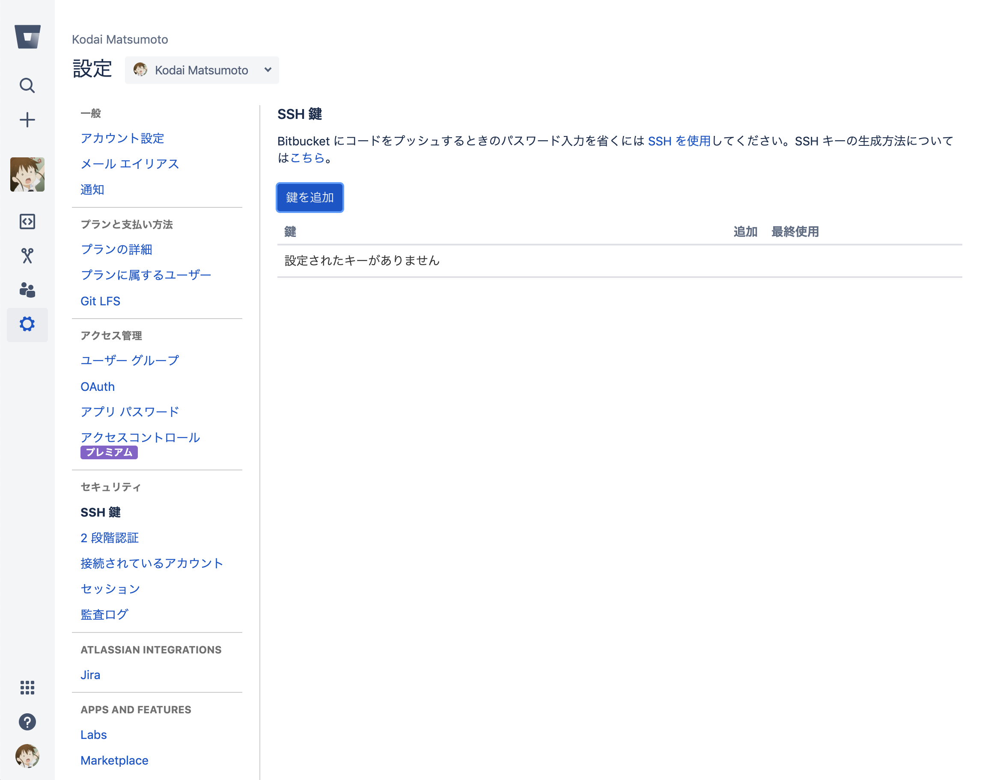
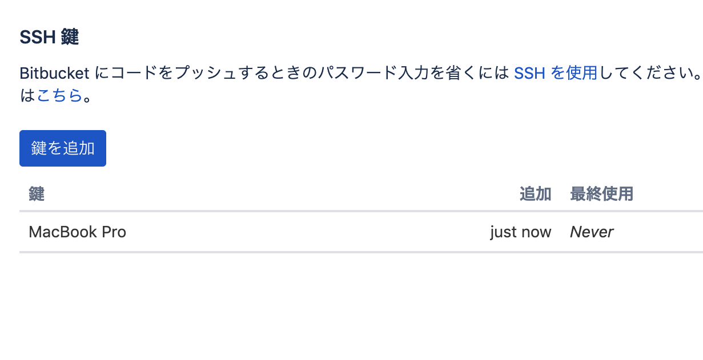

# SSH 鍵の生成・登録

今後 git を操作して Bitbucket 側にアクセスすることになりますが、その際の

### 生成

#### Windows

コマンドプロンプト上で以下のコマンドを実行してください。

```bat
$ cd c:/Users/[ユーザー名]/
$ mkdir .ssh
$ c:/git/bin/ssh-keygen -t rsa
Generating public/private rsa key pair.
Enter file in which to save the key (/c/Users/[ユーザー名]/.ssh/id_rsa): <そのままEnterキーを押す>
Enter passphrase (empty for no passphrase): <パスワードを考えて入力する>
Enter same passphrase again: <もう1度パスワードを入力する>
Your identification has been saved in c:/Users/[ユーザー名]/.ssh/id_rsa.
Your public key has been saved in c:/Users/[ユーザー名]/.ssh/id_rsa.pub.
The key fingerprint is:
~~~~
```

#### macOS / Linux

```bash
$ ssh-keygen -t rsa
Generating public/private rsa key pair.
Enter file in which to save the key (/Users/[ユーザー名]/.ssh/id_rsa): <そのままEnterキーを押す>
Enter passphrase (empty for no passphrase): <パスワードを考えて入力する>
Enter same passphrase again: <もう1度パスワードを入力する>
Your identification has been saved in /Users/[ユーザー名]/.ssh/id_rsa.
Your public key has been saved in /Users/[ユーザー名]/.ssh/id_rsa.pub.
The key fingerprint is:
~~~~
```

### 公開鍵を Bitbucket に登録する

#### SSH鍵の設定画面を開く

Bitbucket トップページ → 左下にあるアイコンをクリックして表示されるメニューから「Bitbucket Settings」を選択 → 左側のメニューから「SSH鍵」を選択



#### 公開鍵を登録する

「鍵を追加」をクリックして開く画面で、ラベルと公開鍵の内容を入力してください。

ラベルはそれぞれの公開鍵を区別するためのものなので、使用しているデバイスの識別名などにしておくといいと思います。

key の欄に公開鍵の内容を入力しますが、先程生成した ``id_rsa.pub`` の内容をクリップボードにコピーしておいて貼り付けてください。

Windows の場合、コマンドプロンプト上で ``clip < c:/Users/[ユーザー名]/.ssh/id_rsa.pub`` を実行するとコピーできます。  
macOS の場合、ターミナル上で ``cat ~/.ssh/id_rsa.pub | pbcopy`` を実行するとコピーできます。

２つとも入力できたら、「鍵を追加」をクリックしてください。


#### 登録されたことを確認する

テーブルに先程入力したラベルで鍵が追加されていることを確認してください。  
これで SSH 公開鍵の登録作業は完了です。



### 参考文献

- [Windowsでssh-keygenから秘密鍵と公開鍵をつくる](http://webdev.jp.net/ssh-keygen-egit-windows/)
