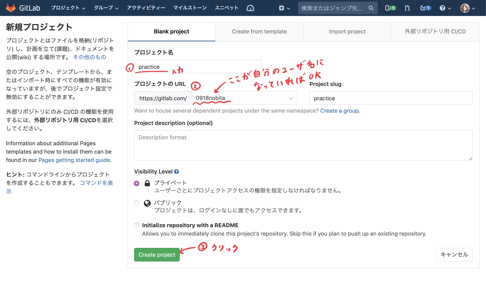
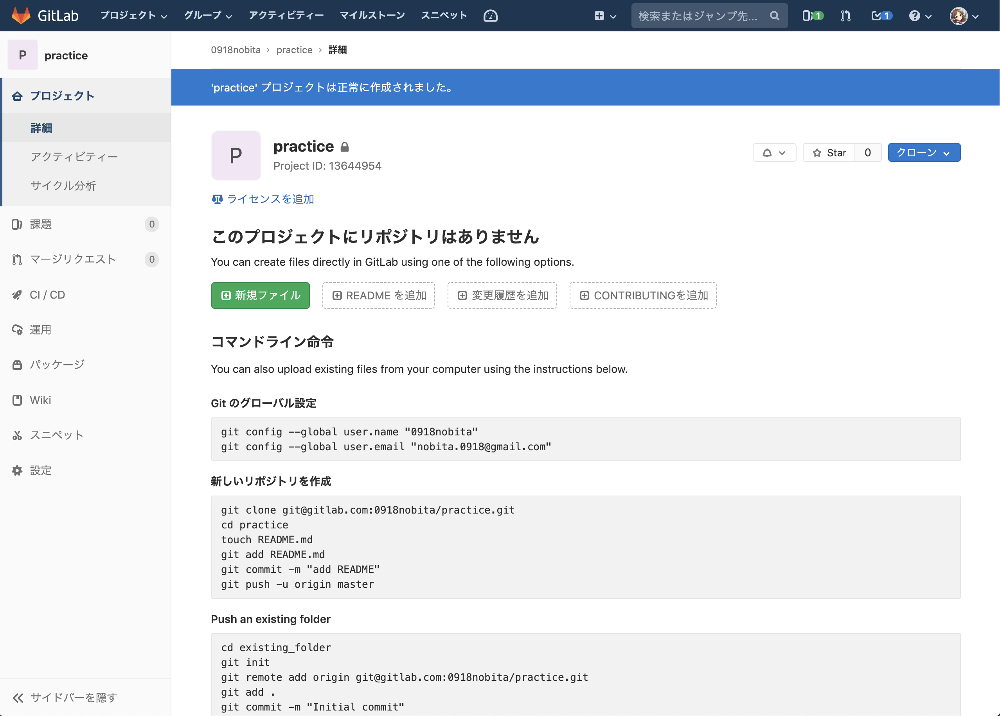

# リモートリポジトリの作成

**【やること8】** 以下の手順でリモートリポジトリを作成してください。

https://gitlab.com/projects/new ← このページを開いてください



↓ リポジトリの作成直後に表示される画面



**【やること9】** 以下のコマンドを実行してリモートリポジトリを登録してください。

```bash
git remote add origin git@gitlab.com:<ユーザ名>/practice.git
```

※ ``<ユーザ名>`` の部分については、``Push an existing Git repository`` の章を参考にしてください。似たようなコマンドを呼び出すように説明されているはずです。

``git remote`` はリモートリポジトリをローカルで管理するためのコマンドです。

``add`` だけでなく ``set-url`` (URLの更新) や ``rename`` (登録名の変更) など、様々なサブコマンドが利用できます。詳しくは ``git remote --help`` で表示されるヘルプを参照してください。

参考になりそうな記事: [基本的な Git コマンドまとめ #remote](https://qiita.com/2m1tsu3/items/6d49374230afab251337#remote)
