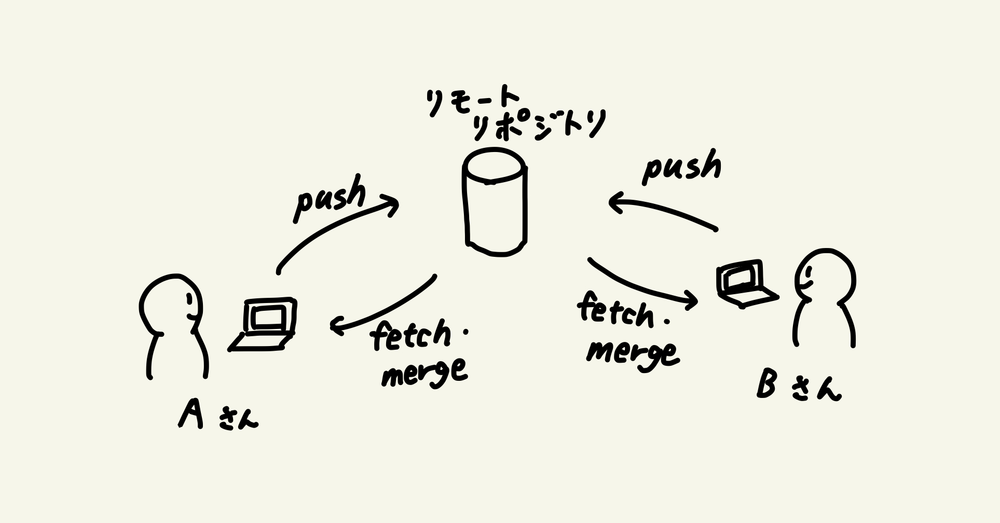
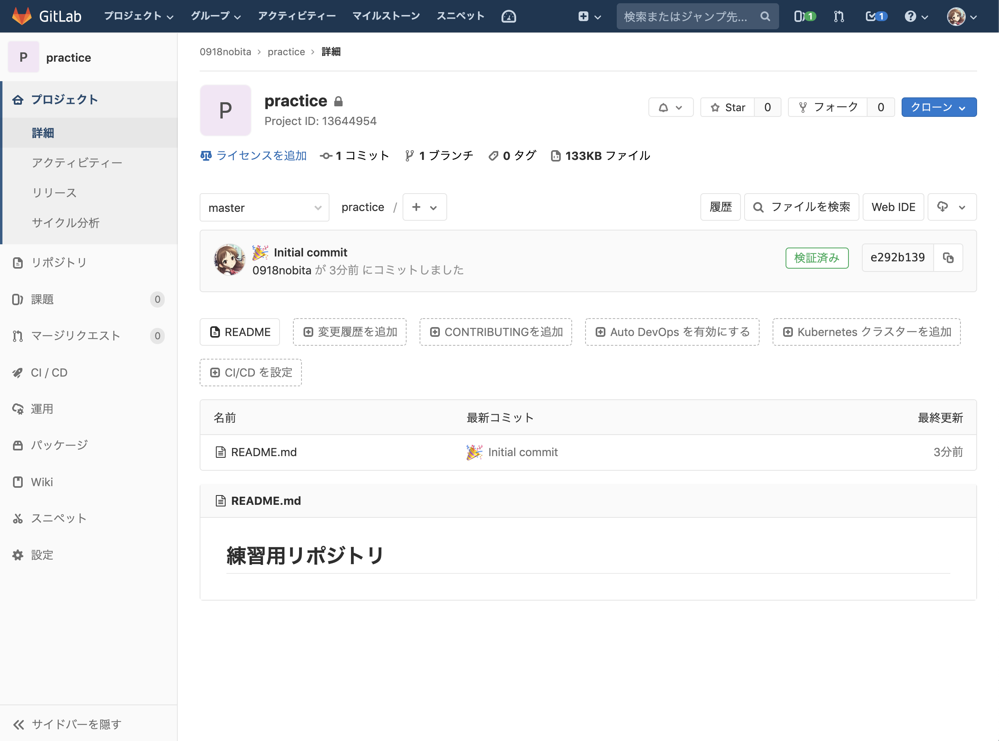

# プッシュ

ローカルリポジトリでの変更をリモートリポジトリに反映する方法が **プッシュ** です。

これと、後述する「フェッチ」「マージ」を利用することで、開発に関わる各人がリモートリポジトリに自分が行った変更を反映したり、他の人がリモートリポジトリに対して反映した変更を自らのローカルリポジトリに反映して作業を続行したりできます。



**【やること10】** 以下のコマンドを実行してプッシュしてください。

```bash
git push origin master
```

## 毎回パスワードが要求される場合の対応策

``~/.ssh/config`` に設定を追記することで解決するようです。

秘密鍵のパス (ここでは ``~/.ssh/id_rsa``) については、環境ごとに適切なパスを指定してください。

### macOS の場合

```bash
Host github.com
  HostName github.com
  Port 22
  User git
  IdentityFile ~/.ssh/id_rsa
  AddKeysToAgent yes
  UseKeychain yes
```

### Linux の場合

```bash
Host github.com
  HostName github.com
  Port 22
  User git
  IdentityFile ~/.ssh/id_rsa
  AddKeysToAgent yes
```

**【やること11】** GitLab で作成したリモートリポジトリのページまで行き、正しくプッシュできていることを確認してください。



自分で新規にリポジトリを作成してコミット・プッシュしてみるハンズオンはここで終了です。

ここから先では、すでに存在するリモートリポジトリに自分が変更を加え、他の人と連携して作業を進めていく方法について扱っていきます。

### 参考文献

https://obel.hatenablog.jp/entry/20180104/1515055969
